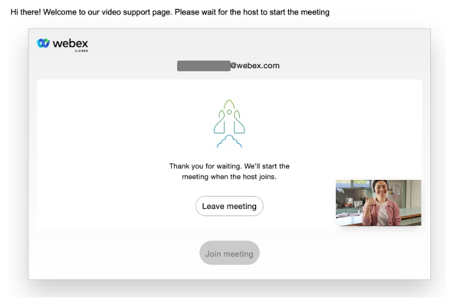
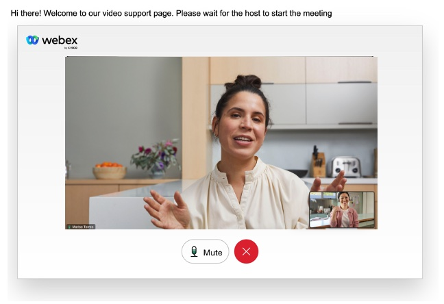

# Video Customer Support

Web server, hosting a simple web page, that illustrates how customer support with video can be offered joining a Webex Meeting from a browser.

# Table of Contents
- [Overview](#overview)
- [How to use it](#how-to-use-it)
- [How to deploy your own version](#how-to-deploy-your-own-version)
   - [Prerequisites](#prerequisites-1)
   - [Create a Service App for Guest Management](#create-a-service-app-for-guest-management)
   - [Authorize your new Service App and get the access token](#authorize-your-new-service-app-and-get-the-access-token)
   - [Build your project](#build-your-project)
- [User Experience](#user-experience)
- [Integrations](#integrations)
- [License](#license)
- [Disclaimer](#disclaimer)
- [Contact](#contact)


# Overview

Customers willing to join Webex Meetings from a browser, in any device, who want to embed the meetings experience into their web site, having full control of the User Interface, can use the [Browser Webex SDK](https://developer.webex.com/docs/sdks/webex-meetings-sdk-web-introduction). An easy way to do this, with few lines of code, is to utilize the [Webex Meetings Widget](https://developer.webex.com/docs/widgets).

This project is based on [Rajitha Kantheti](https://github.com/rajithaBK)'s [embeddable Meeting Widget](https://github.com/wxsd-sales/embeddable-meetings-widget/edit/main/README.md) project, which offers an easy way to consume the Meetings Widget.

To join a Webex Meeting programmatically, an access token is needed. This _node.js_ server creates a Guest Token using a [Service App for Guest Management](https://developer.webex.com/docs/sa-guest-management).

We offer a always-on running instance of the project, and we also provide instruction to deploy your own server.


# How to use it

You need to access a web server on glitch (https://video-support-wxsd.gitch.me) adding some URL parameters:

- ```sipAddress```: This can be a Webex Meeting meeting number, a Webex Meeting link, a person (_user@email.com_), or even a Webex cloud-registered device (_device_name@domain.rooms.webex.com_)!. This parameter is mandatory. 

- ```message```:  A short welcome text message that will be shown to the customer. This parameter in optional, if none is provided, ```"Hi there! Welcome to our video support page. Please wait for the host to start the meeting"``` will be used as default. The text has to be in URL-encoded format.


   Example: ```https://video-support-wxsd.glitch.me/?sipAddress=25321760309@wxsd.webex.com&message=Video%20Support```

## Prerequisites

- Supported Desktop Browsers: Chrome (latest), Firefox (latest), Edge (latest) and Safari (latest)

- Supported Mobile Browsers: Chrome on Android (latest) and Safari on iOS (latest)

   Reference: [Meetings Widget Requirements](https://developer.webex.com/docs/widgets)

- Webex ORG with Webex Meetings enabled. The user joining from the browser is a guest, therefore you will need another user joining the Meeting as a host. This project doesn't support guest-to-gest meetings.

   You can get a developer sandbox for free at: https://developer.webex.com/docs/developer-sandbox-guide.

# How to deploy your own version

## Prerequisites

- Node.js version >= 14.5 must be installed on the system in order to run this through npm


## Create a Service App for Guest Management

1. Log in the [Webex for developers](https://developer.webex.com/) web site as a Webex administrator in your Webex ORG

2. Click on **Start Building Apps** and a **Create a Service App**

3. Choose the App Name, Icon, Contact Email, and a good description, like for example "Service App for Guest Management"

4. Select the `guest-issuer:read` and `guest-issuer:write` scopes

5. Click on **Add Service App**

6. Save your **Client ID** and **Client Secret** somewhere safe

   Do not close this window, you will need to come back here later.

## Authorize your new Service App and get the access token

1. Log in [Control Hub](https://admin.webex.com)  as a Webex administrator in your Webex ORG

2. Go to Apps, and click on **Service Apps**. Your new Service App should be listed

3. Click on the Service App, and enable it by clicking on the **Authorize** toggle switch. If you have more than one webex site in your org, choose in what site you want to authorize the Service App

4. Click on **Save**

5. Go back to Service App creation web page, and refresh it.

6. Under **Authorized orgs**, choose your Webex ORG, paste your Service App Client Secret, and click on **Generate Tokens**. Store the `access_token` somewhere safe

## Build your project

1. Clone this repository and change directory:

   ```
   git clone https://github.com/wxsd-sales/video-customer-support.git && cd video-customer-support.git
   ```

2. Install all the dependencies using:

   ```
   npm install
   ```

3. Go to ```public/main.js``` file, and change the value for the variable ```myServerUrl```. This must be your server URL, if you are running the project locally on your laptop, use ```'http://localhost:3000'```

4. Rename the example environment file from `.env.example` to `.env`:
   ```
   cp .env.example .env
   ```

5. Configure the .env file with your Client ID, Client Secret and Refresh Token. Choose the TCP port to be used, for example 3000


6. Start the application using:
  
   ```
   npm run start
   ```

ADD localhost example

## User Experience

After joining the meeting, the user will be asked to wait for the expert (host) to join:



When the expert joins  the communication setup is completed:



The video widget is draggable, allowing the end user to move it around the screen.

If you want to modify and customize the suer experience, [deploy your own instance](#build-your-project) and modify the files in the ```public``` folder

## Integrations

This support web page can be used standalone, and can also be easily integrated in, for example, a digital conversation with the customer. In this [repository](https://github.com/wxsd-sales/create-meeting-connect-flow) you will find a Webex Connect flow that schedules a Webex Meeting, and creates a link for the customer to join from the support web page.

## License

Distributed under the MIT License. See [LICENSE](LICENSE) for more information.

## Disclaimer

Everything included is for demo and Proof of Concept purposes only. Use of the site is solely at your own risk. This site may contain links to third party content, which we do not warrant, endorse, or assume liability for. These demos are for Cisco Webex use cases, but are not Official Cisco Webex Branded demos.
 

## Contact

Please contact the Webex SD team at [wxsd@external.cisco.com](mailto:wxsd@external.cisco.com?subject=CreateMeetingFlow) for questions. Or for Cisco internal, reach out to us on Webex App via our bot globalexpert@webex.bot & choose "Engagement Type: API/SDK Proof of Concept Integration Development". 

